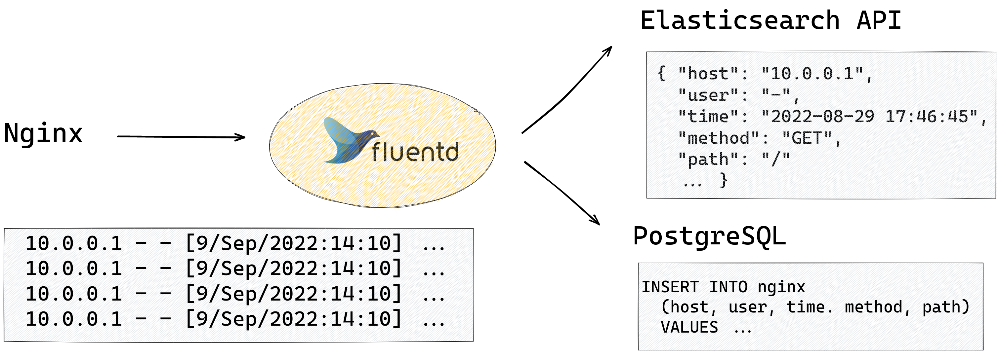

# Intro: Context

* Ruby3x3
* How this talk compares to past talks

::: notes
\scriptsize

最初に、今日の話のコンテキストなんですが、  
まず当然、Ruby 3x3、Ruby3をRuby2の3倍速くしようという計画があったんですが、  
これに現実のアプリから評価を加えようというのが大きなトピックになってます。

\vspace{1em}
こういう「Ruby 3x3を現実のアプリから評価しよう」という講演は、  
実際このRubyKaigiでも過去にいくつかあったんですが、  
基本的にWebアプリケーションとくにRailsからの発表がほとんどでした。

\vspace{1em}
最初に明確に言っておくと、Railsからの見え方は私たちの見え方とは全然異なっている。
なので、今回はFluentdというまったく趣の異なるRubyアプリ、
しかし非常に広く利用されているアプリの立場から新しい視点を提供したいという講演になります。

:::

# Intro: Context

> But we aren’t doing it everywhere, just on a small percentage of traffic for a real web service, basically a canary deployment
>
> (...)
>
> Right now, **it’s really helpful just to have somebody using YJIT at all.**
> If you try it out and let us know what you find, that’s huge!
> 
> \vspace{1.5em}
> https://shopify.engineering/yjit-faster-rubying

::: notes
\scriptsize

もう一つ、最近入った個別の技術について、実際のアプリからコメントを加えたい。  

\vspace{1em}
例えば、Shopifyのチームが開発したYJITなんですが、  
ようやく2021年にRuby本体に入ったばかりでまだ広く使われていない状態にある。  

\vspace{1em}
実際にここに引用しているのは、去年の10月のブログ記事なんですが、  
実はまだShopifyの社内でも、去年の時点では、  
まだユニットテストとかの限られた範囲でのみ有効化していて、  
実際のユーザーからのフィードバックがほしいという話をされている。

\vspace{1em}
今回、FluentdではこういったRubyの新しい改善を取り込んだので、  
Rubyのコア開発者の呼びかけへのアンサーとしての意味もこめている発表になります。 

:::

# Intro: Fluentd

{width=100%}

::: notes
\scriptsize

本題に必要なので、Fluentdの基本について解説を加えてます。  
Fluentdとは2011年から開発がされているプロダクトで11年目になる。  

\vspace{1em}
ポイントとしては、ログを転送するデーモンだと考えてください  
ここに出している灰色の枠がNginxのアクセスログだったりSyslogになります。
これをどこか、例えばElasticsearchに送りたいとすると、  
当然、データ形式としてJSONが期待されるので、このテキストをパースしてJSONに直して、  
ElasticsearchのAPIまで持って行ってやる必要がある。  

それを実現するのがFluentdの役目です。このテキストを読み込んで、  
JSONに直して、ELasticsearchに持っていくまでの一連の流れは基本的にRubyで実装されています。

\vspace{1em}
Elasticsearchを例に出しましたが、Kafkaだったり、S3だったりにも送れます。  
いろんなログをいろんなところに送れるようにしよう、というプロジェクトになります。

:::

# Intro: Fluentd

> **I have 20 servers who forward their logs to 1 td-agent on the host machine.
> Total hits in a day range between 400-1000 million** including all the servers.
> Thus td-agent at host receive this much data daily.
>
> \vspace{1.5em}
> https://github.com/fluent/fluentd/issues/2103

::: notes
\scriptsize

今回の発表と関連する点でいえば、Fluentdはむちゃくちゃ大量のRubyのオブジェクトを扱います。  
例えば、これはちょっと前にGitHubのissueで寄せられたコメントなんですが、  
日次で4〜10億個ぐらいのレコードを処理している。

\vspace{1em}
なので、流量が均等だと過程して1時間あたり400万件、  
1秒間あたり1万件を超えるレコードを処理している。  
これを365日24時間Rubyで処理し続ける形になります。

\vspace{1em}
これは全然アウトライアーではない。なんでこんな流量になるかというと、 
グローバルに拠点をもつ企業が全社のサーバーに入れてログを集約してたり、  
アクセス数が途方もなく多いサイトのアクセスログを集めてたりする。

\vspace{1em}
それで一行一行がRubyのオブジェクトに直して転送するので、  
1時間あたり何百万ものオブジェクトを常時扱い続けるのは珍しくない。

\vspace{1em}
要点としては、fluentdはRubyのランタイムを使い倒しているということになる。

:::

# Intro: Comparison to Rails

> I do not think there is any chance that a large production rails app is going to
> hit 3x because (...) **So much of its time is not Ruby calculation that speeding
> calculation by 3x doesn't speed up a large rails app by 3x.**
> 
> \vspace{1.5em}
> Noah Gibbs "Six Years of Ruby Performance: A History" (RubyKaigi 2019)

::: notes
\scriptsize

ここから何が言えるかというと、比較として過去のRubyのパフォーマンスのよくある分析として  
Railsに焦点を当てた分析が多い。

\vspace{1.5em}
Railsの基本的な特徴として、DBから何か引っ張ってきてWebサーバー経由で返すという仕組みになっている。  
最も重たい処理、大量のデータからレコードを引っ張ってくるような処理は、  
実はRubyの外、MySQLだったりがやっている。

\vspace{1.5em}
このRubyKaigiでも例えば2019年にNoah Gibbsという方がその趣旨で発表されているんですが、  
このスライドに引用しているのは、その講演からの引用です。

\vspace{1.5em}
つまり、Ruby 3x3でRailsが3倍になったりすることはない。  
なぜならば、実は処理時間の大半がRubyの外で費やされているからである。

:::

# Intro: Comparison to Rails

{width=80%}

::: notes
\scriptsize

同じような指摘は別の講演でもなされている。  
これはSamuel Williamsさんの講演からの引用なんですが、基本的なポイントは同じです。

\vspace{1.5em}
彼らが言わんとしていることは完璧に意味をなす。  
Ruby3x3で3倍になったとしても、Railsへの速度貢献はそれよりずっとモデレートである。    
なぜかというと、Railsアプリの中で、Rubyコードの実行が占めている部分は、  
ほんの一部、この青い部分でしかないからである。

\vspace{1.5em}
で、明確に言っておきたいのは、今日のトークはそういうトークではありません。
なぜかというと、私達はRubyで実際に重いデータ処理をやっているからです。  

\vspace{1.5em}
この点が、今回のトークがこれまでの講演と最も違うポイントだと思います。
:::

# Intro: Fluentd (cont)

> | Release Date  | td-agent | Ruby    |
> | ---------- | -------- | ------- |
> | 2014-10-20 | v1.1.21  | v1.9.3  |
> | 2017-10-04 | v2.3.6   | v2.1.10 |
> | 2020-12-10 | v3.8.0   | v2.4.10 |
> | 2022-08-23 | v4.4.1   | v2.7.6  |
> | 2023-08-23 | v4.4.1   | v3.1.2 [^1] |
>
> [^1]: For Ubuntu 22.04. Experimental.

::: notes
\scriptsize

もう一つ、Fluentdの特徴として息の長いプロジェクトというのがある。  
Ruby v1の時代から開発が続いていて、それぞれのRubyを梱包した  
スナップショットが残っています。

\vspace{1.5em}
実際、いまRuby2.0で何かアプリを実行しようとしても、動かすだけで一苦労だったりします。  
その点、私達は配布パッケージが残っているので比較的用意にテストできる。

\vspace{1.5em}
実際にここに表を出しているんですが、Ruby 1.9.3から始まって、  
Ruby2.1.10、Ruby2.4.10、そしてこれが今の最新版ですがRuby2.7.6のパッケージがある。  
また、一部のOS向けに先行して、Ruby3.1.2のパッケージを提供しています。

\vspace{1.5em}
Ruby1.9から3.2まで全部のバージョンが揃っている訳ではないんですが、  
こうやって長期的に比較できるのがFluentdの一つの大きな強みです。
:::

# Intro: Summary

* CRuby performance is very important for Fluentd.

* Fluentd has some advantage when comparing Ruby versions.

::: notes
\scriptsize

ここまでの話をまとめます。

\vspace{1.5em}
Fluentdは非常にRubyのランタイムのパフォーマンスに依存しているプロジェクトである。  
従って、この点が今日の発表が過去の講演とは違っている部分です。

\vspace{1.5em}
Fluentdは10年ほど続けてやっているプロジェクトで、  
過去のスナップショットが残っている。

\vspace{1.5em}
このためRubyバージョンのパフォーマンス比較という点ではユニークな強みがある。

:::

# Ruby Version Landscape

{width=100%}

::: notes
\scriptsize

今回、過去のリリースのスナップショットを利用して、  
Rubyのバージョンごとにパフォーマンスを測定しました。  
どうやって測定したか？を説明しているのがこの図です。

\vspace{1.5em}
基本的には大きなファイル、1000万行のLTSVとNginxのアクセスログのファイルを用意して、  
これをFluentdに読み込ませた形になっています。  
それで、一行一行を読み込んで、形式をパースしたものを出力させて、  
そのスループットをカウントしました。

\vspace{1.5em}
基本的に、非常によく使われているフローを模倣してます。何かファイル、  
アクセスログだったりを読んで、それをパースするというのが、  
かなりの部分を占めるワークロードなので。

:::

# Ruby Version Landscape: LTSV

{width=100%}

::: notes
\tiny

この図は今日のメインのトピックになります。  
Ruby 1.9から3.xでFleuntdを動かして、速度を計測した結果です。  
縦軸が一秒あたりに処理できた行数を表してます。横軸がRubyのバージョンです。

\vspace{1.5em}
見ていただけると分かるんですが、1.9だと秒間8.5万行を処理するのがせいぜいだったんですが、  
2.1で10万行を超えるようになってます。2.4で13万行、2.7では19万行に到達して、  
3.1では同じぐらいです。

\vspace{1.5em}
この3.2というのは当然未リリースなので、Rubyレポジトリの最新版を手元でビルドしたものです。
そのビルドしたrubyを利用した結果、1秒間に23万行を処理できました。  
それで、そのバージョンで更にYJIT、これはあとで触れるんですが、これを有効化したところ、  
さらに15%の改善が見られて、26万行を処理できる形になりました。というのがこのグラフの意味です。

\vspace{1.5em}
で、ここから言えることとして、Ruby 3.2は1.9、これは8年前の2014年にリリースされた  
バージョンなんですが、その3倍、正確には3.15倍のスループットが出ていることが  
おわかりいただけると思います。  

:::

# Ruby Version Landscape: Nginx

{width=100%}

::: notes
\scriptsize

同じように、NginxのアクセスログをFluentdで解析して計測したのがこのグラフです。

\vspace{1.5em}
基本的には前のスライドと同じパターンが見て取れると思います。  
1.9では6.6万行を処理できるのがせいぜいだったんですが、  
Rubyのバージョンを追う毎に概ねパフォーマンスが上がっていき、  
3.2では1秒間に17万行を処理できるようになっています。

\vspace{1.5em}
なので、Nginxのアクセスログをパースするようなケースでも、1.9と比較して、
まあ3倍にこそ及ばないが、2.5倍ぐらいになっている。
:::

# Ruby Version Landscape: On Ruby3x3

> Ruby 3 will be 3 times faster than Ruby 2. I'm actually not sure
> how to make it happen, but I have set the goal anyway so that we can
> start thinking how to archive it.
>
> \vspace{1.5em}
> RubyKaigi 2015 Key Note (translated)

::: notes
\tiny

したがって、2015年、7年前のRubyの講演で松本さんが述べていたことを
ちょっと英訳してスライドに載せたんですが、  
Ruby3はRuby2の3倍早くなる。何をやれば3倍早くなるって分かって言っているわけじゃないけど、  
先にゴールをセットしてどうするかを考えよう、と宣言されている。

\vspace{1.5em}
今日のポイントとしては、1.9と3.2との比較なんですが、  
概ねこの宣言が達成されている、というのが私が言いたかったポイントになります。
これを今日大いに強調したくて、この会場に来ました。

\vspace{1.5em}
過去の講演だと、Ruby3x3は悪くないけど、別にそこまでインパクトはないね、みたいな話が多かったんですが、  
私たちFluentdにとってはちゃんとパフォーマンスのインパクトとして現れている。  
これはぜひとも言っておきたい

もう一度繰り返します。私たちにとってRuby3x3は概ね実現されました。

\vspace{1.5em}
じゃあこれで完璧ですね、もう言うことなしですね、かというと、  
ちょっとこれをもっと広いコンテキストに位置づけさせてください。  

:::

# Language Landscape

{width=100%}

::: notes
\scriptsize

これはメジャーなスクリプト言語ごと、具体的にはRuby、Python、Lua、Perlで、
基本的に一対一に対応するようにテキストをパースするコードを書きました。

\vspace{1.5em}
それで同じマシンの上で、同じファイルを各言語で処理させて、  
そのスループットを比較したものです。  

\vspace{1.5em}
RubyについてはYJITありなしで計測しました。Luaについても、  
LuaJITという有名なJIT実装があるので、2パターンで計測しました。
:::

# Language Landscape: Ruby/Python

{width=95%}

::: notes
\scriptsize

これが計測に利用した、RubyとPythonの実装です。  
左がRubyで右がPythonの実装なんですが、ほぼ完璧に対応していることが分かると思います。

\vspace{1.5em}
まず、LTSVという関数があって、最初にハッシュオブジェクトを定義します。  
行をタブ文字で区切って、各トークンをさらにコロンで分割します。  
それでキーとバリューのペアをハッシュに格納します。  
それで出来上がったハッシュオブジェクトを返却します。

\vspace{1.5em}
本文では、標準入力から一行一行読み出して、LTSV関数で解析してます。  
最後に最後の一個のレコードを、一種のサニティチェックのような形で  
出力して終わるという形です。

\vspace{1.5em}
ので、RubyとPythonに一対一対応する形で同じ処理を実行させてます。
:::

# Language Landscape: Lua/Perl

{width=95%}

::: notes
\scriptsize

これが同じ要領でLuaとPerlの実装です。

\vspace{1.5em}
ちょっと馴染みがないかもしれませんが、本質的に先ほどと同じ処理、  
LTSV関数があって、タブ文字で切って、コロンで切って、  
ハッシュオブジェクトに格納している。

\vspace{1.5em}
それで、本文では標準入力を行ごとに読み込んで、処理してます。  
LuaとPerlは直接ハッシュオブジェクトを出力できないので、ちょっとループを回して、  
RubyとPythonと同じような形で最後のレコードを出力してます。  

ので実行している処理は各言語で完璧に対応しているというのが  
お分かりいただけると思います。
:::

# Language Landscape (cont)

{width=100%}

::: notes
\scriptsize

これはちょっとクイズ形式で出させていただこうと思います。  
選択肢は、Ruby、Ruby+YJIT、Python、Lua、LuaJIT、Perlという6種類です。  
で、Luaだけは埋めてます。Luaだと40万行ぐらい処理できました。

\vspace{1.5em}
後はなんでしょう？というのが今日の皆さん向けのクイズになってます。  
これをちょっと考えていただきたい。 

\vspace{1.5em}
まず一番右側、一番速かった言語からから聞いてきたいんですが、  
どなたか、何だと思いますか？この言語は。  
答えてみようという方は手をあげてみてください。

:::

# Language Landscape (cont)

* (Continue to next slide)

::: notes
\scriptsize

というわけで正解はなんですが...
:::

# Language Landscape (cont)

{width=100%}

::: notes
\scriptsize

こんな形になっています。これが今日のトークの第二のポイントになります。

\vspace{1.5em}
まず、今回利用したコードは、実際にFluentdで使われているパーサーのコードです。  
それを、先ほどお見せしたように、ほぼ一行一行対応するように忠実にコードを翻訳して、  
まったく同じマシンの上で、まったく同じデータを与えて、  
可能な限り条件が揃う形で計測しました。

\vspace{1.5em}
ここまでの議論の通り、Ruby3x3で過去のRubyと比較して確かに大きく速度改善がされたんですが、  
他の言語を含めたより広い視点で見た時に、実はものすごく速いかというと、  
そうとは限らないというのがポイントになります。

\vspace{1.5em}
とくにテキスト処理のケースでは、他の言語と比べて見劣りするケースがある  
というのが正直な現状になります。  
というわけで、この話がどこにつながるかというと、
:::

# Language Landscape (cont)

{width=90%}

::: notes
\scriptsize

去年の松本さんの講演の"Ruby 3x3 Revisited"につながるんだと思います。

\vspace{1.5em}
去年の講演を聞かれた方なら分かると思うんですが、  
Ruby 3.xはRuby3.0より3倍速くしようということを宣言されていた。

\vspace{1.5em}
これが本当に実現されると、Fluentd開発者としてはもしろん嬉しいし、  
先ほどの話、他の言語と比較して見劣りするという話も解決されるかもしれない。
:::

# Language Landscape (cont)

{width=90%}

::: notes
\scriptsize

これと並行して、昨年の講演でも触れられていたんですが、  
PythonではMark Shannonの方の計画に基づいて、  
毎年1.5倍の速度向上を繰り返して、4年で速度を5倍にしようというかなり野心的な計画を立てている。

これがいわゆる「シャノンプラン」と呼ばれる計画です。

画面煮出しているのは、先々月あったEuroPythonというイベントでの  
進捗のプレゼンテーションになります。
:::

# Language Landscape (cont)

{width=90%}

::: notes
\scriptsize

で、去年の発表の時点からの大きなアップデートとして、  
実はPython3.11のRC1のリリースがちょうど1ヶ月前の8月8日に公開されたんですが、
ここに引用しているのはそのリリースノートからです。

\vspace{1.5em}
標準ベンチマークで10%から最大で60%。平均すると22%の改善が見られた、  
という発表をしている。

\vspace{1.5em}
なので、3x3 Revisitedのような同じような計画は他の言語でも一足先に進んでおり、  
成果を出している状態にある。

\vspace{1.5em}
なので、Rubyのコア開発者の方からみると、ちょっと色々コメントがあるところだと思うんですが、  
アプリの開発者の立場からすると、  
Ruby 3x3 Revisitedもぜひ実現されると嬉しいなあと思っています。
:::

# Language Landscape: Summary

* Ruby 3x3
  * Delivered.
* Compared to other languages
  * Not necessarily fast.
* Our hope!
  * "Ruby 3x3 revisited"

::: notes
\scriptsize

\vspace{1.5em}
ここまでのまとめとしては、Ruby 3x3はFluentdについては実現された。  
これは明確に言えて、現実にパフォーマンスへのインパクトがあった形になります。

\vspace{1.5em}
ただ、他の言語と比較すると、まだまだ高速と言えるまでには至ってないという現状になる。

\vspace{1.5em}
将来としては "Ruby 3x3 Revisited" につながっていく話になります。

:::

# Discussion: Ruby 3

* Ruby 3
  * Mostly painless to migrate
* Compatibility issues
  * [rb_funcall() may reset the latest socket error unexpectedlly since Ruby 3.0.0](https://bugs.ruby-lang.org/issues/17813)
  * [FileUtils.rm methods swallows only Errno::ENOENT when force is true](https://github.com/ruby/ruby/commit/983115cf3c8f75b1afbe3274f02c1529e1ce3a81)
* Future
  * Ship Fluentd with Ruby 3.2 (from March 2022)

::: notes
\tiny

それで最後になんですが、Ruby3速くなったなら使ってみようかなと思う方も多いと思うんですが、  
Fluendを3系に移植しました。その経験に基づいて、各論形式で駆け足で議論したい。

\vspace{1.5em}
まずRuby 3.xなんですが、移植がどんだけ大変だったかというと、  
おおむねスムーズにアップデートできました。

\vspace{1.5em}
完全にトランスパレントかというとそうではなく、  
Fluentdでも主にWindowsについてバグだったり互換性の問題があったんですが、  
バグの部分は報告して本体側で直してもらって、互換性の部分は直した。

\vspace{1.5em}
たとえばソケットのエラーがバグで上手くとれなかったとか、  
Fileまわりで挙動が変わっていたという点です。これはRuby 3.2で概ね解決されています。

\vspace{1.5em}
Fluentdは来年3月にRuby3.2ベースで正式にリリースする予定です。  
ので、皆さんのアプリもRuby3で動いて、性能改善を享受できると思います。
:::

# Discussion: YJIT

{width=80%}

::: notes
\scriptsize

Ruby 3.2に移植すると何がいいかというと、YJIが使えるんですが、  
これは素晴らしいの一言につきる。  

\vspace{1.5em}
FluentdにYJITサポートを有効化するオプション追加したんですが、  
これを有効化することで約10%のFluentdの速度向上が確認できています。

\vspace{1.5em}
実は、Rubyの3.2previewでFluentdを動かすとクラッシュする不具合があるので、
こちらも完全にトランスパレントとは言えないが、  
3.2のmasterだとスムーズに動くので、来年の3月のリリースに入れる予定である。

\vspace{1.5em}
なので、YJITについては現実の運用で使われだすと思います。

\vspace{1.5em}
引用しているのがPRで、もともと入れる予定だったんですが、  
実はこのRubyKaigiで発表したくて先行して実装して入れました。
:::

# Discussion: Ractor

{width=100%}

::: notes
\scriptsize

最後にRactorについて。ここまで聞かれた方はわかると思うんですが、  
今回のトークでRactorという言葉はこれまで一度も出てきてません。  
なぜかというと、まだ我々が使いこなせていないというのが現状になる。

\vspace{1.5em}
というのも、Ractorを利用すると、並列実行ができるというのが売りなんですが、  
一方で、オブジェクトの共有について制限がつく。  
実は、Fluentdのベースクラスにこの制限にひっかかる仕組みがあり、  
引用したようなエラーが発生する。

\vspace{1.5em}
なので、Fluentdのプラグインは数千個あるんですが、  
Ractorの中で一切使えないという状態になっている。

\vspace{1.5em}
というわけで、Ractorを活用しようとすると、ちゃんと動くようにエンジニアリングする必要がある。  
そこまで到達できていないので、Ractorを活用したという報告ができるのは、来年以降になりそうです。
:::

# Conclusion

* Ruby3.x
  * Mostly painless.
* YJIT
  * Awesome.
* Ractor
  * We're working on it!

::: notes
\scriptsize

今日のトークの最後のスライドになります。

\vspace{1.5em}
話をまとめると、Ruby 3.xはFluentdのようなアプリでもおおむねスムーズに移行が可能であった。  

\vspace{1.5em}
YJITについてはすばらしいの一言に尽きる。  
来年3月に正式リリースするので、また話ができればと思います。

\vspace{1.5em}
Ractorはいま取り掛かっているので来年にこうご期待！という形になります。

\vspace{1.5em}
以上、クリアコード藤本の講演でした。ご清聴いただきありがとうございます。
:::
